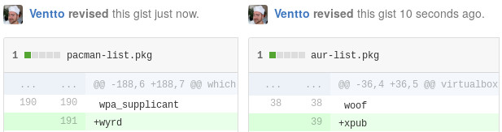

Pug
===

[](https://github.com/Ventto/xpub/blob/master/LICENSE)
[](https://github.com/defunkt/gist)

*"Pug is a ALPM-hook to automatically save installed Pacman & AUR package lists into Gist files."*

Inspired by [*plist-gist*](https://github.com/DerekTBrown/plist-gist) and [*pacmanity*](https://github.com/alexchernokun/pacmanity).

## Perks

* [x] **Painless**: Do not care about remembering installed packages on your system.
* [x] **Triggers**: Installing, removing and upgrading packages triggers *pug*.
* [x] **Elegant**: Fading into the background, *pug* uses the coloration of pacman's output.
* [x] **Smart**: Avoids Gist revisions when updating only known packages.
* [x] **Extra**: Leverage Gists to quickly install your package list on another system.

## Requirements

* *pacman* - A library-based package manager with dependency support
* *gist* - Potentially the best command line gister

# Installation

### Package (AUR)

```bash
$ pacaur -S pug
```

### Manually

```bash
$ git clone https://github.com/Ventto/pug.git
$ cd pug
$ sudo make install (default: INSTALLGIST=1, gists creation)
```

### Uninstall

```bash
$ sudo make uninstall
```

# Screenshots



# FAQ

## Leverage Gist for quick deployment

The purpose of using Gist files is to quickly install your preferred packages on another system.

* Quick install the Pacman package list:

```bash
$ wget https://gist.githubusercontent.com/.../pacman-list.pkg
$ pacman -S - < pacman-list.txt
```

* Quick install the AUR package list:

```bash
$ wget https://gist.githubusercontent.com/.../aur-list.pkg
$ xargs <aur-list.pkg pacaur -S
```

## Change Gist filenames

Take a look at the sources into `src/pug.sh` or after installation into `/opt/pug/pug.sh`.

# TODO

* [ ] Choose to update only pacman package list, only AUR or both.

